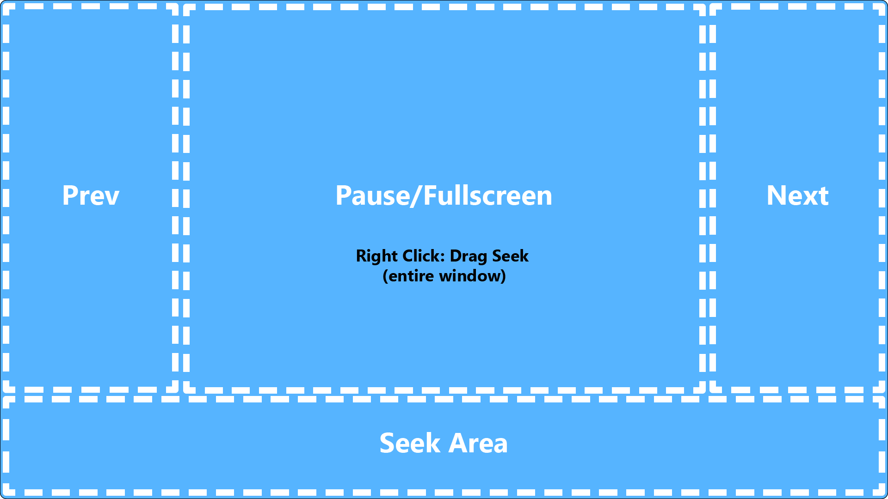

# mpv-scripts
## Scripts
* [custom-osc](#custom-osclua)
* [web search](#web-search)
* [delete-file](#delete-filelua)
* [move-file](#move-filelua)
* [move-file-datetime](#move-file-datetimelua)
* [move-file-subfolder](#move-file-subfolderlua)
* [cut-video](#cut-videolua)
* [next-file](#next-filelua)
* [load-dir-auto](#load-dir-autolua)
* [playlist-sort](#playlist-sortlua)
* [clean-playlist](#clean-playlistlua)
## Other
* [Notes](#Notes)
* [Installing Files](#Installing-Files)

# custom-osc.lua
A minimal on screen controller desgined to use the entire window.

Basic Functionality
* Left Click Sides = Next/Prev
* Left Click Center = Play/Pause 
* Double Left Click center = Toggle Fullscreen
* Left Click Bottom = Seekbar
* Right Click Anywhere = Drag-Seek


#### Installation
1. Copy [custom-osc.lua](custom-osc.lua) to your mpv scripts directory.
2. Add the following commands to **input.conf**
```
MBTN_LEFT       script_message custom-osc-left-click
MBTN_LEFT_DBL   script_message custom-osc-left-double-click
MBTN_RIGHT      ignore
MOUSE_MOVE      script_message custom-osc-mouse-move
WHEEL_UP        osd-msg add volume 10
WHEEL_DOWN      osd-msg add volume -10
```
3. Add the following commands to **mpv.conf**
```
osc=no
no-window-dragging
osd-margin-x=10
osd-margin-y=10
osd-bar-w=100
osd-bar-h=1
osd-bar-align-x=0
osd-bar-align-y=1
osd-border-size=2
osd-font-size=26
osd-scale-by-window=no
title= [${playlist-pos-1}/${playlist-count}] [${duration}] [${file-size}]   ${filename}
osd-status-msg=${time-pos} / ${duration} \nPL ${playlist-pos-1}/${playlist-count}
```

# Web Search
Search any website for the currently playing file. No script is necessary for this functionality.
#### Example 1
Add the following line to **input.conf**. Uses the default search engine in firefox.
```
F1 run "C:\\Program Files\\Mozilla Firefox\\firefox.exe" "-search" "${filename/no-ext}"
```
#### Example 2
Add the following line to **input.conf**. Searches https://anidb.net/ website .
```
F2 run "C:\\Program Files\\Mozilla Firefox\\firefox.exe" "-url" "https://anidb.net/search/anime/?adb.search=${filename/no-ext}&do.search=1"
```
#### Usage
Uses the firefox [command line](https://developer.mozilla.org/en-US/docs/Mozilla/Command_Line_Options) to open a website and search for the currently playing filename without extension.

# delete-file.lua
Deletes the currently playing video file.
#### Installation
1. Copy [delete-file.lua](delete-file.lua) to your mpv scripts directory.
2. Add the following line to **input.conf**
```
Ctrl+DEL script_message delete-file
```
#### Usage
Activating this command will delete the currently playing video file and also remove it from the playlist.

# move-file.lua
Moves the currently playing video file to a specified folder.
#### Installation
1. Copy [move-file.lua](move-file.lua) to your mpv scripts directory.
2. Add the following line to **input.conf**
```
Ctrl+1 script_message move-file "C:\\Folder1"
```
3. Edit ```"C:\\Folder1"``` as needed (double slashes are required).
#### Usage
Activating this command will move the currently playing video file to the specified folder (if the folder doesn't exist then it will be created). It will also remove the file from the playlist. 

# move-file-datetime.lua
Moves the currently playing video file to a timestamped subfolder.
#### Installation
1. Copy [move-file-datetime.lua](move-file-datetime.lua) to your mpv scripts directory.
2. Add the following line to **input.conf**
```
Ctrl+2 script_message move-file-datetime
```
#### Usage
Activating this command will move the currently playing video file a timestamped subfolder e.g. ```.\20200425203645\video.mkv```. The timestamp remains until mpv is closed. The playlist entry is also removed for the video file.

# move-file-subfolder.lua
Moves the currently playing video file to a specified subfolder.
#### Installation
1. Copy [move-file-subfolder.lua](move-file-subfolder.lua) to your mpv scripts directory.
2. Add the following line to **input.conf**
```
Ctrl+3 script_message move-file-subfolder "Subfolder1"
```
3. Edit ```"Subfolder1"``` as needed (no slashes).
#### Usage
Activating this command will move the currently playing video file to the specified subfolder e.g ```.\Subfolder1\video.mkv```. The playlist entry is also removed for the video file.

# cut-video.lua
Uses ffmpeg to cut sections of the currently playing video. The original video is untouched.
#### Installation
1. Copy [cut-video.lua](cut-video.lua) to your mpv scripts directory.
2. [ffmpeg.exe](https://www.ffmpeg.org/download.html) must either be copied to your mpv install folder or added to your Windows Environment Variables (Path) so that it can be located by the script.
3. Add the following text to **input.conf**
```
#required
Ctrl+Left script_message cut-left
Ctrl+Right script_message cut-right
Ctrl+Up script_message cut-start
Ctrl+Down script_message cut-end
Ctrl+ENTER script_message cut-finish

#optional
#Ctrl+ENTER script_message cut-finish "avi" 
#Ctrl+ENTER script_message cut-finish "webm" "-filter:v crop=200:200:0:0 -q:a 0 -q:v 4"
```
#### Usage
```Ctrl+LEFT``` sets the left position

```Ctrl+RIGHT``` sets the right position

```Ctrl+UP``` sets the left position to 00:00:00

```Ctrl+DOWN``` sets the right position to end of file 

```Ctrl+ENTER``` Begins cutting that section of video to a new file. 

You can also set an optional file extension if you wish to convert the video to a different format.


# next-file.lua
Loads the next video file from the current directory. No playlist is used. The file types can be edited in the script as necessary.
#### Installation
1. Copy [next-file.lua](next-file.lua) to your mpv scripts directory.
2. Add the following command to **input.conf**
```
Alt+e script_message next-file
```

# load-dir-auto.lua
Automatically adds files from the current directory (not recursive) to the playlist. Files are sorted by filename in ascending order. File types can be edited in the script. Script only runs once per mpv instance.
#### Installation
1. Copy [load-dir-auto.lua](load-dir-auto.lua) to your mpv scripts directory.
#### Usage
No action required; loading happens automatically after playback begins. 

# playlist-sort.lua
Sorts the current playlist by filename, date modified, or size. After sort is complete it begins playing from the top.
#### Installation
1. Copy [playlist-sort.lua](playlist-sort.lua) to your mpv scripts directory.
2. Add the following commands to **input.conf**
```
1 script_message playlist-sort name asc  
2 script_message playlist-sort name desc
3 script_message playlist-sort date asc
4 script_message playlist-sort date desc
5 script_message playlist-sort size asc
6 script_message playlist-sort size desc
```

# clean-playlist.lua
Removes all entries from the current playlist that are not video files.
#### Installation
1. Copy [clean-playlist.lua](clean-playlist.lua) to your mpv scripts directory.
2. Add the following command to **input.conf**
```
Alt+c script_message clean-playlist
```
#### Usage
Activating this command will remove all entires from the current playlist that are not video files. This is useful when the playlist has unwanted file types (images, music, etc).


## Notes
* Scripts have only been tested on Windows 10
## Installing Files
Any one of the following locations will work for installing **scripts**.
* \<install directory\>\scripts\anyscript.lua
* \<install directory\>\portable_config\scripts\anyscript.lua
  
Any one of the following locations will work for installing **config files** (input.conf, mpv.conf).
* \<install directory\>\input.config
* \<install directory\>\portable_config\input.config
